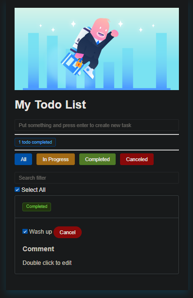

# Планировщик на Vue.js

### Описание
Приложение для управления списком дел - добавления, изменения, указания их статуса (выполнено, в процессе, отложено, отменено) и примечания. Возможность фильтрации заданий по их статусу или тексту.
Возможно объединение с заданием "Планировщик", в котором бек написан на PHP/NodeJS (баллы суммируются в таком случае).

Инструкция пользователя: Открыть терминал в папке
1. Прописать npm install
2. Прописать npm run serve

### Результаты:

